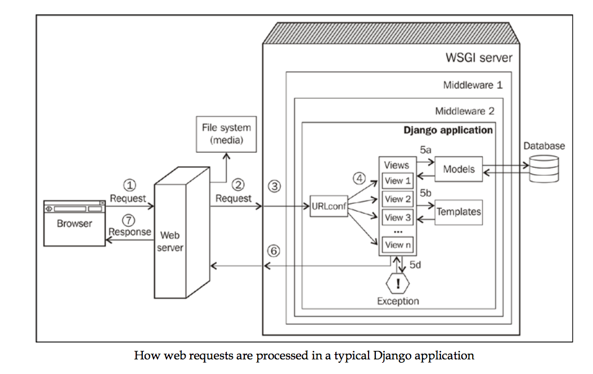

#第一章 Django和模式

这一章节我们将会讨论以下主题：

- 为什么选择Django？
- Django的前世今生
- Django是如何工作的
- 模式是什么？
- 著名的模式有哪些
- Django的模式

Bowei Gai的“世界创业公司报告”显示，2013年全世界有超过136000家互联网公司，而其中仅在美国的就有超过60000家。在这些公司中，有87家美国公司估值超过了十亿美元。另一项研究表明，在来自27个国家里18到30岁之间的12000人之中，有三分之二的人都觉得有机会成为企业家。

这一股数码行业里的创业风产生的主要原因之一是创业公司需要的工具和技术开始逐渐变得廉价和普遍。得益于各种威力强大的框架，现在创建一套完整的Web应用比以前需要的时间大大减少。

即使对于编程初学者，学会创建一个Web应用的学习曲线也非常的平滑。然而，很快他们就不得不持续地解决别人已经遇到并解决过的问题。理解“模式”正是为了帮助我们在这一点上节约更多的时间。

##为什么选择Django

每一个Web应用都像一件手工家具一样是与众不同的。你很难找到一个量产的应用可以完美满足你的所有需求。即使你从最简单的需求开始，比如一个博客系统或者是一个社交网络系统，你的需求仍然会缓慢增长，直到一个原本很简单的方案被修补得面目全非。

这就是为什么像Django或者Rails这样的Web框架变得如此流行。框架可以加速整个开发进程，并且它们已经整合了非常多的最佳实践。与此同时，它们也灵活到你可以只操作你所需要的部分。现如今，Web框架十分普遍，几乎所有的语言都至少有一个类似Django的端到端框架。

Python拥有的Web框架也许比大多数的编程语言都多。在[PyPi](https://pypi.python.org/pypi)上大致扫一眼就可以看到惊人的13021个与框架相关的包。与Django相关的一共有5467个。

Python维基所列出的包含了54个活跃Web框架的列表里，Django，Flask， Pyramid和Zope是最流行的。Python里的Web框架类型也非常的广泛。压缩过的微Web框架Bottle仅仅包含一个Python文件，并且不需要任何的依赖包就可以创建一个简单的Web应用。

尽管有着如此多的选择，Django仍然成为了大众偏爱的选择。Djangosites.org上列出了超过4700个使用Django开发的网站，其中不乏非常出名的成功例子，比如Instagram， Pinterest和Disqus。

正如[Django官方文档](https://djangoproject.com)所述，Django是用Python开发的高层Web框架，旨在对快速开发和干净务实的程序设计提供支持。换句话说，这是一个自带能源的完整的Web框架，就跟Python一样。

Django独一无二的特性，极具创意的admin接口对于早期的数据管理和测试帮助极大。Django作为一个开源项目，其优雅详尽的文档也备受赞誉。

Django也是在很多高流量网站上经历过实战考验的。而且它非常注重安全问题。对于常见网络攻击，比如Cross-site scripting(XSS)和Cross-site request forgery(CSRF)，Django非常注重防范。

尽管理论上说，你可以用Django开发任何Web应用，但是它并不一定总是最正确的选择。比如你想要开发一个基于Web的实时聊天界面，Tornado也许更好，不过整个Web应用别的部分仍然可以用Django开发完成。记得选择最正确的工具。

如果你习惯了别的Web框架，那Django一些内置的特性，比如admin界面可能会让你觉得很奇怪。为了理解Django的设计，让我们来看看Django的前世今生吧。

##Django的前世今生

当你仰望埃及金字塔的时候，你可能会觉得这么简单的设计来的非常容易吧。事实上，它们是4000年建筑学进化的结晶。纵观金字塔的设计，最原始(也很笨重）的设计是用六个尺寸递减的方砖堆砌。经过了建筑学和工程学的数次发展才最终发明并使用了更现代，更明亮，也能持续更长时间的石灰岩结构。

在阅读Django的时候，你也许会有同样的感觉。既然它现在如此的优雅，那当初的设计也一定是完美无瑕的吧。恰恰相反，它实际上是不断改写，极速迭代开发的产物。并且是在几乎最高压的环境下完成的——新闻办公室！

在2003的秋天，Adrian Holovaty和Simon Willison两位程序员在Lawrence Journal-World报社就职。他们当时准备在Kansas写几个当地的新闻网站。这些包括LJWorld.com, Lawrence.com和KUsports.com的网站和其他的新闻网站一样，不只是需要处理大量文字，照片和视频的内容驱动门户网站，它们还必须满足Lawrence社区对于应用的需求。这些应用包括商业指南，事件日历，分类等等。

###框架的诞生

这项任务对于Simon，Adrian和后来加入他们小组的Jacob Kaplan Moss来说毫无疑问是非常重的。给他们的期限常常非常短，有时候甚至只有几个小时。而且当时对于Python来说还是Web框架早期，他们几乎要从头写起。为了节约宝贵的时间，他们逐渐开始重构了一些通用的模块和工具，并将他们整合成了一个他们称之为“The CMS”的系统。

最终，内容管理系统部分被分离成了另一个他们称之为“Ellington CMS”的项目。这个项目后来成为了非常成功的商业CMS产品。“The CMS”剩下的部分则成为了一个非常漂亮的基础框架。这个框架非常的通用，可以用来构造各种类型的Web应用。

2005年7月，这个Web开发框架被命名为Django(读作Jang-Oh)，并以开源许可**Berkeley Software Distribution(BSD)**发布了。这个名字来源于传奇爵士吉他手Django Reinhardt。接下来就是众所周知的故事了。

###返璞归真

由于Django最初只是一个不起眼的内部工具，它保留了很多只适合Lawrence Journal-World的特性。为了让Django真正成为一个通用的框架，人们发起了一项名为“去除Lawrence”的项目。

但是，对于Django来说真正意义重大的重构其实是另一项被称为“移除魔法”的项目。这一项目包括了去除掉Django常年累积下来的小毛病，以及将很多魔法(编程俚语，指未显式说明的特性)用更自然，更易于阅读的Python风格代码替换。比如说，之前的model类是通过一个神奇的django.models.*模块来引入的，而不是从定义这个类的文件models.py文件显示引入。

那个时候，Django积累了数十万行代码，并且API也几乎被大量重写了。在2006年5月1日，所有这些加起来快够一小本书的代码被整合进了Django的开发版本，并且以0.95版本号发布了。这是在通往发布Django 1.0的里程碑上迈出的非常重要的一步。

###Django不断变得更好

每年都会有被称为DjangoCons的会议在世界各地举办，以便让Django开发者之间能互相交流。他们有一个非常可爱的传统，即展示一个半幽默式的幻灯片“为什么Django弱爆了”。展示者可以是Django社区的成员，也可以是其他竞争Web框架的使用者，或者是某个名人。

多年之后，我们惊讶地看到Django开发者非常积极地面对着这些批评，并且将它们在一系列的版本发布中一一克服。以下是部分Django曾经的缺点以及它们被解决的发布版本：

 - 新的表格处理库 (Django 0.96)
 - 将admin从model里分离 (Django 1.0)
 - 多数据库支持 (Django 1.2)
 - 更好地处理静态文件 (Django 1.3)
 - 更好的时区支持 (Django 1.4)
 - 可自定义的User模型 (Django 1.5)
 - 更好的事务处理 (Django 1.6)
 - 内置数据库数据迁移 (Django 1.7)

经过时间的洗礼，Django已经成为了最符合Python规范的开源代码库之一。Django的源代码简直是学习Python Web框架结构的最佳资源。

##Django是如何工作的

要想真正享受Django，你必须看到遮罩之下不同的部件。这部分也许可以让你领悟很多，但也可能过于繁琐。如果你已经熟悉了这部分，跳过这部分会是更好的选择。

上图展示了一个从用户浏览器里发出的请求经过整个Django应用以后再返回的过程。数字标示的路径含义如下：

  1. 浏览器向你的服务器发起请求(实质上就是一串二进制编码)。
  2. 你的Web服务器(比如说Nginx)会将这个请求转交给WSGI服务器(比如uWSGI)或者直接从通过系统返回文件(比如CSS文件)。
  3. 和Web服务器不一样的是，WSGI服务器可以运行Python应用。这个请求会生成一个名为`environ`的Python字典，并经过层层的中间件(非必需)，最终到达你的Django应用。
  4. 你的应用的`urls.py`文件里包含的URLconf会根据请求的URL选择合适的视图来处理这个请求。这个请求会被转换成`HttpRequest`——一个Python对象。
  5. 被选中的视图一般会做如下操作：
  	6. 通过模型访问数据库
  	7. 使用模版生成HTML或者格式化过的回复
  	8. 返回纯文本回复
  	9. 抛出异常
  10. `HttpResponse`对象在离开Django应用的时候会被转换成一个字符串。
  11. 用户的浏览器上会出现一个漂亮的渲染好的网页

尽管我们忽略了一些细节，但是以上步骤应该仍然能够很好地帮助你理解Django的整体架构。并且它也很好地展示了一些像是模型，视图和模板这类重要的组件在整个过程里扮演的角色。Django的很多组件都是基于数个著名的设计模式开发的。

##模式是什么？

“蓝图”，“脚手架”，“维护”这些词有什么共同点？这些软件开发的名词都是从结构和建筑的世界里引进的。不过，这其中最著名的引进词出现在1977年的一篇关于结构和城市设计的论文里。这篇论文由澳大利亚的建筑师Christopher Alexander带领的小队完成的。小队其他成员包括Murray Silverstein，Sara Ishikawa等人。

他们的原创作品_A pattern Language: Towns, Buildings, Construction_提出了一个非常有洞察力的观点，即用户往往比建筑师更清楚他们的建筑。而“模式”这个词在这篇论文出现之后迅速流行起来。模式指的是一些日常问题以及已经被时间验证过的解决方案。

在这本书中，Christopher Alexander写道“每一个模式都描述了一个在我们的世界里不断重复出现的问题，以及一个你可以反复使用的解决方案。这样你就不用每次都重新从头解决这个问题了。”

举个例子，有天然采光的翼楼这一建筑模式描述了人们更喜欢天然采光这一现象，并建议建造能增加自然采光的翼楼。这些翼楼最好是又长又狭窄，一定不要超过25英尺宽。下次你漫步在一所历史悠久的大学的长走廊里的时候，感谢这个设计模式吧。

这本书里描述了253个这样的实用模式，小到设计房间，大到设计整个城市。最重要的是，每一个模式都为一类抽象的问题进行了命名。所有这些模式一起组成了一个_模式语言_。

还记得你第一次看到déjà vu这个词的时候么？你一定在想“天哪，我从来没想过还有词来描述这种体验。”类似的，建筑师们也终于可以在认出他们世界里的各种问题的同时，使用其他人可以理解的词来命名他们了。

在软件世界里，名词_设计模式_指的是用来解决一些在软件设计里反复出现的问题的通用的，可以复用的解决方案。这是开发者们可以直接使用的最佳实践。和在建筑世界里一样，模式语言已经被证实可以为程序员之间交流设计问题的解决方案提供显著帮助。

设计模式的数量并不少，但是其中有部分影响力非常大。

###模式四人帮

早期有一本关于帮助学习并汇总了一些设计模式的书，叫做_Design Patterns: Elements of Reuseable Object-Oriented Software_。这本书的四位作者，Erich Gamma，Richard Helm，Ralph Johnson和John Vlissides后来被称作**四人帮**(Gan of four)。这本书影响力大到不少人将其中包含的23个设计模式看作是软件工程的基础。

事实上，这些模式大部分都是为面向对象的程序语言设计的，里面例子使用的语言是C++和Smalltalk。很快我们将会看到，这里面不少模式在其他有更高层抽象的设计语言譬如Python里，是完全不需要的。

这23个模式按照它们的类型被分为了：

 - **创造模式**： 包括抽象工厂，构造器模式，工厂模式，原型模式和单例模式
 - **结构模式**： 包括适配器模式，桥接模式，组合模式，装饰模式，外观模式，享元模式和代理模式
 - **行为模式**： 包括职责链模式，命令模式，解释器模式，迭代器模式，中介者模式，备忘录模式，观察者模式，状态模式，策略模式，模板方法模式，访问者模式

尽管详细解释这些模式超出了这本书的范畴，在Django里搜寻这些模式的影子仍然很有趣：

<table>
	<tr>
		<th>模式名</th>
		<th>Django组件</th>
		<th>解释</th>
	</tr>
	<tr>
		<td>命令模式</td>
		<td>HttpRequest</td>
		<td>这个组件会将一个请求封装成一个对象</td>
	</tr>
	<tr>
		<td>观察者模式</td>
		<td>Signals</td>
		<td>当一个对象的状态改变时，所有监听这个实践的其它对象都会得到通知并自动更新状态</td>
	</tr>
	<tr>
		<td>模板模式</td>
		<td>Class-based generic views</td>
		<td>算法的每一个小步骤都可以在子类中被重写，无须修改整个算法的结构</td>
	</tr>
</table>

想要了解Django内部构造的人一定会对这些模式非常感兴趣，但是Django作为整体应该被分到哪一个模式里也是一个经常被问到的问题。

###Django是MVC架构吗？

**模型－视图－控制器**(Model-View-Controller, MVC)是Xerox PARC在70年代发明出来的。因作为框架被用于构建Smalltalk的用户界面，模式四人帮写的书里很早就提到过它。

现今，MVC在Web应用框架里已经非常流行了。初学者往往都会问——Django是不是MVC框架？

答案是既是也不是。MVC模式提倡将表现层和应用逻辑解耦。举个例子，在设计在线游戏的网战API时，游戏的最高得分表可以被设计成HTML，XML或者CSV文件。但是底层的模型类在设计时并不会考虑这些数据将被以何种方式呈现。

MVC对于模型，视图和控制器的作用要求非常严格。但是Django选择了对于Web应用来说更实际的视角去看待它们。HTTP协议的天然特性决定了每一个页面的请求都是独立于其它请求的。Django的框架被设计成了类似流水线的结构，以便于一个一个处理请求并响应。

Django将之称为**模型－模板－视图**(MTV)架构。数据库底层类(模型)，请求处理类(视图)和用于最终表现的模板语言(模板)有着各自不同的设计考虑。如果一定要将这个架构和经典的MVC比较－模型和Django定义的模型是类似的，视图则更接近Django定义的模板，控制器则是将每一个HTTP请求转交给对应视图的Django框架本身。

如果你还没被绕糊涂，Django倾向于将处理不同URL的函数命名为“视图”函数。这里的视图和MVC模式里的视图并不是同一个概念。

###Fowler的模式

2002年，Martin Fowler写了一本名为_Patterns of Enterprise Application Architecture_的书，书里描述了他在搭建企业级应用时所常遇到的约40种模式。

模式四人帮的书主要描述了设计模式，而Fowler的书则不同，它描述的是关于架构的模式。因此，他描述的模式抽象层次更高，并且和程序语言无关。

Fowler的模式被归类为：

 - 领域逻辑模式： 包括领域模型，事务脚本，服务层和表模块
 - 数据源架构模式： 包括行数据入口，表数据入口，数据映射器和活动记录
 - 对象关系行为模式： 包括标识映射，工作单元和延迟加载
 - 对象关系结构模式： 包括外键映射，依赖映射，关联表映射，标识域，序列化LOB，嵌入值，继承映射器，单表继承，具体表继承和类表继承
 - 对象关系元数据映射模式： 包括查询对象，元数据映射和资源库
 - Web表现模式： 包括页面控制器，前端控制器，模型视图控制器，转换视图，模版视图，应用控制器和两步视图
 - 分布式模式： 包括数据转移模式和远程外观
 - 离线并发模式： 包括粗粒度锁，隐含锁，乐观离线锁和悲观离线锁
 - 会话状态模式： 包括数据库会话状态，客户端会话状态和服务器会话状态
 - 基本模式： 包括映射器，入口，层超类型，注册表，值对象，分离接口，货币，插件，特殊情况，服务桩和记录集

几乎以上所有模式在构建Django应用的时候都会有用。事实上，[Fowler的网站](http://martinfowler.com/eaaCatalog/)有非常好的以上模式的手册。强烈建议你们去看一看。

Django也实现了不少以上模式。这里列举出部分例子：
<table>
	<tr>
		<th>Fowler模式</th>
		<th>Django组件</th>
		<th>解释</th>
	</tr>
	<tr>
		<td>活动记录</td>
		<td>Django模型</td>
		<td>将访问数据库的逻辑封装，并将领域逻辑添加到对应数据</td>
	</tr>
	<tr>
		<td>类表继承</td>
		<td>模型继承</td>
		<td>继承结构里的每一层都被映射到了独立的表里</td>
	</tr>
	<tr>
		<td>标识域</td>
		<td>Id字段</td>
		<td>在数据库里给每一个对象分配ID来标识它们</td>
	</tr>
	<tr>
		<td>模版视图</td>
		<td>Django模版</td>
		<td>通过嵌入在HTML里的标记来渲染HTML</td>
	</tr>
</table>

###还有其它模式吗？

当然。新的模式不断地在被发现。而且，和生物一样，一些模式还会变形组成新的模式：拿MVC为例，它的变种包括**模型－视图－表现者(MVP)**，**层次模型－视图－控制器(HMVC)**以及**模型 视图 视图模型(MVVM)**。

当已知问题被研究出新的解决方案的时候，与之相关的模式也会随之进化。举个例子，单例模式曾经被认为是设计模式的一种，但是因为它引入了类似全局变量的状态共享因素，现在它被认为是反模式的。**反模式**指的是那些被反复使用的错误解决方案。

还有一些包含了模式手册的书包括：Buschmann，Meunier，Rohnert，Sommerlad和Sta的_Pattern-Oriented Software Architecture_(一般称作POSA)；Hohpe和Woolf的_Enterprise Integration Patterns_以及Duyne，Landay和Hong的_The Design of Sites: Patterns, Principles, and Processes for Crafting a Customer-Centered Web Experience_。

###这本书里的模式

这本书会讲到Django开发者关心的跟Django相关的设计和构建模式。以下部分会描述我们将以何种方式呈现这些模式。

**模式名**

首先是模式名。如果这是很著名的模式，那么我们会使用其被广泛使用的模式名；反之我们会使用一个简洁的能自我解释的模式名。因为名字会用于构建整个模式词库，所以谨慎地选择它们是非常重要的。所有的模式都会有以下组成部分：

**问题**： 简单介绍问题

**解决方案**： 解决方案的简单总结

**问题细节**： 详细介绍问题的内容，可能会给出对应的例子

**解决方案细节**： 解释问题的通用解法并给出Django实现的样例

###关于模式的批判

尽管模式被广泛使用，我们仍然能看到一些关于模式的负面评价：

 - **模式是在给程序语言缺失的特性买单**： Peter Norvig发现23种设计模式里有16种在Lisp里是“更简单甚至根本不需要的”。考虑到Python的运行时类型检查能力和头等函数特性，它很可能和Lisp有类似的情况。
 - **模式实际上就是在重复最佳实践**： 很多模式实质上是很多最佳实践，比如概念分离的组合而已，它们也许是多余的。
 - **模式也许会导致过度开发**： 与实现一个简单的解决方案相比，实现一个模式有时候会更低效更繁琐。

###如何使用模式

尽管上述批判不少是有道理的，但是很多仍然是因为对模式错误的使用而导致的。以下建议可以帮助你更好的理解如何正确使用模式：

 - 如果你的编程语言有非常直接的解决方式，不要使用模式
 - 不要尝试把一切都对应到各个模式上
 - 只有当模式在你的情况里是最优雅的解决方式时才使用它
 - 不要害怕创造新的模式

###最佳实践

除了设计模式以外，一个问题往往有一个推荐的途径。在Django，同时也是Python里，解决一个问题往往有好几种不同的方式，但是其中也藏着最符合语言习惯的一个。

###Python之禅和Django的设计哲学

Python社区一般喜欢使用“Pythonic”来描述符合Python语言习惯的代码。它特制“Python之禅”指出的设计原则。它把设计原则这样一个非常流行的概念描述得非常好，并且写得跟诗一样。

>试着在Python里输入import this来查看“Python之禅”

更进一步，Django开发者将他们在设计整个框架时使用的设计哲学非常简洁地总结了下来：[https://docs.djangoproject.com/en/dev/misc/design-philosophies/](https://docs.djangoproject.com/en/dev/misc/design-philosophies/)。

尽管这个文档描述的是当初设计Django时的思路，它对开发者开发Django应用仍然非常有帮助。像**不要重复你自己(Don't Repeat Yourself, DIY)**，**低耦合**，**高聚合**等设计原则在你开发和维护Django应用的时候非常有用。

Django或者Python的最佳实践会以如下方式推荐给你：

>**最佳实践**:
>
>使用settings.py里的BASE_DIR来存放目录名而不是硬编码

##总结

这一章我们了解了为什么人们在众多的Web框架里选择了Django，Django有趣的历史以及它的基本运行原理。我们也了解了设计模式的概念，流行的设计模式以及一些最佳实践。

下一章，我们会看一看创建Django工程之初所需要的一些简单的步骤，比如把需要的依赖包准备妥当，创建一些小样例，设置好整个工程。