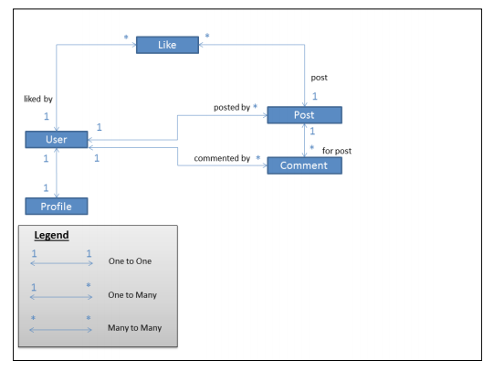

# 第三章 模型    
    
这一章，我们将会讨论以下话题：

 - 模型的重要性
 - 类图
 - 模型的结构模式
 - 模型的行为模式
 - 数据库迁移

## M比V和C都重要

在Django里，模型是可以以面向对象的方式与数据库交互的类。一般来说，一个类对应数据库里的一张表，而一个类的属性对应数据库里的一列。你可以用自动生成的API来发出数据库请求。

模型是其他所有组件的基础。一旦你有了模型，你马上就可以使用模型管理器，模型表单和各种各样的通用视图。使用它们中的任何一个你仍然需要一两行代码，不然它们也过于神奇了。

而且，能用到模型的地方远比你想象的多。这主要是因为Django有很多种运行方式。这些方式中包括：

 - 常规的Web“请求-响应"流程
 - Django互动命令行
 - 管理命令
 - 测试脚本
 - 异步任务执行器，比如Celery

在几乎所有这些方式下，模型模块都会被引入(作为`django.setup()`过程的一部分)。因此，尽可能减少你模型里不必要的依赖包以及其他Django模块，比如视图。

总而言之，好好设计你的模型非常重要。下面让我们开始SuperBook模型的设计。

>__午餐研讨会__
>
>_笔者注：SuperBook项目的进度会以这样的形式呈现出来。你可以跳过这样的部分，但那样你就会错过开发Web应用项目能了解到的，经历到的东西，以及一些有趣的事情。_
>
>Steve与他的客户，超级英雄情报与监视局，简称S.H.I.M合作的第一个星期经历比较复杂。整个办公室非常有未来感，但是任何事情都需要层层批准签字。
>
>作为Django开发者领队，Steve花了两天时间搭建好了一个中等规模的服务器，运行着四个虚拟机。但是接下来的一天，这个服务器消失了。旁边一个洗碗机大小的机器人说这个服务器因为安装未经许可的软件被取证部门收走了。不过好在公司的CTO，Hart伸出了援手。他在一个小时内就要回了服务器，里面已安装的软件也完好无损。为了防止以后再发生类似的事情，他还预批准了这台机器上所有的软件安装。
>
>当天下午，Steve和他进行了一场午餐研讨会。Hart穿着一身米色西装和淡蓝色牛仔裤准时到场。尽管他比很多人都要高，还留着光头，他仍然让人觉得非常好相处。他问Steve有没有看看之前60年代为超级英雄建立数据库的尝试。
>
>“啊，有的，Sentinel项目，对吧？”Steve说道。“我看了。那个数据库好像是用条目－属性－值的模型设计的，我觉得这比较反模式。估计那时候他们并不清楚超级英雄有多少属性。”Hart在听到最后一句话的时候几乎打了个寒噤。他用稍低的声音说道，“你是对的，我确实不知道。而且他们当时只给了我两天就要我设计出整个项目。我觉得这个项目有很大的问题。”Steve长大了嘴巴，送到一半的三明治也停在了嘴边。Hart笑到，“这显然不是我的得意项目。一旦超过十亿条记录，在那个数据库上进行的任何数据分析都要花几天。SuperBook只需要几秒钟对吧？”
>
>Steve轻轻点了点头。他一开始也完全没想到会有接近十亿的超级英雄。

## 模型分析

这里是定义SuperBook模型的第一步。一般来说，对于早期尝试，我们只把最本质的模型和它们之间的关系表示为一个类图：

我们先不管模型，让我们先从对象的角度来建模。每个用户都有一个用户资料。一个用户可以对数个发布内容作出多次评论。一个**赞**和一个用户/发布内容的组合关联。

我们很推荐像这样为你的模型画一个类图。它们也许不包含所有的属性，但是你可以之后再去关注这些细节。当整个项目都被画上了类图后，要把它们分成应用就会更简单。

这里是画类图时的一些小建议：

 - 方框代表一个实体，最后会变成模型。
 - 在你的概念文档里的名词一般都是实体。
 - 箭头是双向的，在Django里可以表示以下三种关系中的一种：一对一，一对多(以外键方式实现)和多对多。
 - 标出一对多关系的属性应该在实体关系模型(ER-model)中定义出来的。换句话说，标星号的地方即是应该声明外键的地方。

这个类图可以对应到如下的Django代码中(它们可以分布在不同的应用里)：

    class Profile(models.Model):
        user = models.OneToOneField(User)

    class Post(models.Model):
        posted_by = models.ForeignKey(User)

    class Comment(models.Model):
        commented_by = models.ForeignKey(User)
        for_post = models.ForeignKey(Post)

    class Like(models.Model):
        liked_by = models.ForeignKey(User)
        post = models.ForeignKey(Post)

之后我们会看到，我们不再直接调用`User`，而是调用更通用的`settings.AUTH_USER_MODEL`。

## 将`models.py`分解成多个文件

就像Django的其它组件一样，一个巨大的`models.py`文件也可以被分成多个文件放在同一个软件包里。一个**软件包**一般以目录的形式实现，里面可以包括数个文件，但必须包含一个特殊的名为`__init__.py`的文件。

所有能通过包访问的类必须声明在`__init__.py`里面。举个例子，如果我们把`models.py`分成一个个单独的类，对应的models文件夹里的子类文件分别是`postable.py`，`post.py`，`comment.py`，那么`__init__.py`文件应该像这样：

    from postable import Postable
    from post import Post
    from comment import Comment

现在你可以像之前一样引用`models.Post`了。

`__init__.py`文件里的其它代码在引入的时候也会执行。所以这也是对包进行初始化的理想位置。

## 结构模式

这一部分包含了几种可以帮助你设计和架构模型的模式。

### 模式 － 标准化模型

__问题__： 设计上，模型的实例会有重复的数据，可能会导致数据不连续。

__解决方案__： 通过标准化，将你的模型分解成更小的模型。通过逻辑关系连接他们。

#### 问题细节

设想有人将我们的Post表设计成如下的样子(忽略特定的列)：

<table>
    <tr>
        <th>超级英雄名</th>
        <th>信息</th>
        <th>发布于</th>
    </tr>
    <tr>
        <td>Captain Temper</td>
        <td>Has this posted yet?</th>
        <td>2012/07/07 07:15</th>
    </tr>
    <tr>
        <td>Professor English</td>
        <td>It should be 'Is' not 'Has'.</th>
        <td>2012/07/07 07:17</th>
    </tr>
    <tr>
        <td>Captain Temper</td>
        <td>Has this posted yet?</th>
        <td>2012/07/07 07:18</th>
    </tr>
    <tr>
        <td>Capt. Temper</td>
        <td>Has this posted yet?</th>
        <td>2012/07/07 07:19</th>
    </tr>
</table>

但愿你注意到了最后一行超级英雄名字的不一致性(以及队长一贯的没耐心)

如果我们只看第一列，我们根本不能确定哪一个拼写是正确的——_Captain Temper_还是_Capt. Temper_。这正是我们需要通过标准化消除的冗余数据。

#### 解决方案细节

在我们介绍完整的标准化解决方案之前，让我们先来简单看一眼Django环境下的数据库层面的标准化。

##### 标准化的三步

标准化可以帮助你更高效地存储数据。当你的模型完全地标准化了，他们不应该有任何的冗余数据，每个模型也只会包含与它逻辑相关的数据。

举个简单的例子，如果我们要标准化Post表好让我们可以随意将信息与超级英雄关联，那我们就得把用户信息分离到单独的一个表里。Django默认已经创建了用户表。所以，你只需要引用发布信息的用户的ID就可以了，如下表所示：

<table>
    <tr>
        <th>超级英雄ID</th>
        <th>信息</th>
        <th>发布于</th>
    </tr>
    <tr>
        <td>12</td>
        <td>Has this posted yet?</th>
        <td>2012/07/07 07:15</th>
    </tr>
    <tr>
        <td>8</td>
        <td>It should be 'Is' not 'Has'.</th>
        <td>2012/07/07 07:17</th>
    </tr>
    <tr>
        <td>12</td>
        <td>Has this posted yet?</th>
        <td>2012/07/07 07:18</th>
    </tr>
    <tr>
        <td>12</td>
        <td>Has this posted yet?</th>
        <td>2012/07/07 07:19</th>
    </tr>
</table>

现在不光我们知道有三条数据来自同一个用户(ID是随意给的)，而且我们也能通过查询用户表获取正确的用户名了。

一般来说，你需要先以完全标准化的形式设计你的模型，然后因为性能原因选择性地去标准化一部分。在数据库里，**标准化范式**是一系列可以用来确保你的表是标准化的规则。常用的范式有第一，第二和第三范式，尽管最多可以一直到第五范式。

下一个例子里，我们将会标准化一张表，并创建对应的Django模型。设想有一张名为“_目击_”的表，其中列出了超级英雄第一次被目击使用某种能力或超人类力量。每一条记录储存了他们的出身，超能力，第一次目击的位置，包括经度和纬度。

<table>
    <tr>
        <th>姓名</th>
        <th>出身</th>
        <th>超能力</th>
        <th>第一次目击(经度，纬度，国家，时间)</th>
    </tr>
    <tr>
        <td>Blitz</td>
        <td>外星人</td>
        <td>
            冰冻 
            飞行
        </td>
        <td>
            +40.75，-73.99；美国；2014/07/03 23:12 
            +34.05，-118.24；美国；2013/03/12 11:30
        </td>
    </tr>
    <tr>
        <td>Hexa</td>
        <td>科学家</td>
        <td>
            念动 
            飞行
        </td>
        <td>
            +35.68，+139.73；日本；2010/02/17 20:15 
            +31.23，+121.45；中国；2010/02/19 20:30
        </td>
    </tr>
    <tr>
        <td>Traveller</td>
        <td>亿万富翁</td>
        <td>时间旅行</td>
        <td>
            +43.62，+1.45；法国；2010/11/10 08:20
        </td>
    </tr>
</table>

以上位置数据来自[http://www.golombek.com/locations.html](http://www.golombek.com/locations.html)

###### 第一范式(1NF)

要想满足第一范式，一张表必须：

 - 没有一个属性(格子)包含多个值
 - 主键必须是单独的一列或是多个列的组合(组合键)

让我们尝试把我们的表单转换成一个数据库表。明显的，我们的"_能力_"列不满足第一条规则。

更新过后的表格满足了第一范式的要求。此处主键(标注了*)是'_姓名_'和'_能力_'的组合，每一行的主键是独一无二的。

<table>
    <tr>
        <th>姓名*</th>
        <th>出身</th>
        <th>能力*</th>
        <th>经度</th>
        <th>纬度</th>
        <th>国家</th>
        <th>时间</th>
    </tr>
    <tr>
        <td>Blitz</td>
        <td>外星人</td>
        <td>冰冻</td>
        <td>+40.75170</td>
        <td>-73.99420</td>
        <td>美国</td>
        <td>2014/07/03 23:12</td>
    </tr>
    <tr>
        <td>Blitz</td>
        <td>外星人</td>
        <td>飞行</td>
        <td>+40.75170</td>
        <td>-73.99420</td>
        <td>美国</td>
        <td>2013/03/12 11:30</td>
    </tr>
    <tr>
        <td>Hexa</td>
        <td>科学家</td>
        <td>念动</td>
        <td>+35.68330</td>
        <td>+139.73330</td>
        <td>日本</td>
        <td>2010/02/17 20:15</td>
    </tr>
    <tr>
        <td>Hexa</td>
        <td>科学家</td>
        <td>飞行</td>
        <td>+35.68330</td>
        <td>+139.73330</td>
        <td>日本</td>
        <td>2010/02/19 20:30</td>
    </tr>
    <tr>
        <td>Traveller</td>
        <td>亿万富翁</td>
        <td>时间旅行</td>
        <td>+43.61670</td>
        <td>+1.45000</td>
        <td>法国</td>
        <td>2010/11/10 08:20</td>
    </tr>
</table>

###### 第二范式或称2NF

第二范式必须满足第一范式的所有条件。并且，它还必须满足所有的非主键列应该依赖于整个主键。

在上一张表中，注意到'_出身_'只依赖超级英雄，也就是'_姓名_'。至于那一列对应的是哪种_能力_并不重要。因此，_出身_并不依赖于整个组合主键——_姓名_和_能力_。

让我们把出身信息提取到另一张表里，起名为'_出身_'：

<table>
    <tr>
        <th>姓名*</th>
        <th>出身</th>
    </tr>
    <tr>
        <td>Blitz</td>
        <td>外星人</td>
    </tr>
    <tr>
        <td>Hexa</td>
        <td>科学家</td>
    </tr>
    <tr>
        <td>Traveller</td>
        <td>亿万富翁</td>
    </tr>
</table>

更新以后，我们的_目击_表满足第二范式的要求了：

<table>
    <tr>
        <th>姓名*</th>
        <th>能力*</th>
        <th>经度</th>
        <th>纬度</th>
        <th>国家</th>
        <th>时间</th>
    </tr>
    <tr>
        <td>Blitz</td>
        <td>冰冻</td>
        <td>+40.75170</td>
        <td>-73.99420</td>
        <td>美国</td>
        <td>2014/07/03 23:12</td>
    </tr>
    <tr>
        <td>Blitz</td>
        <td>飞行</td>
        <td>+40.75170</td>
        <td>-73.99420</td>
        <td>美国</td>
        <td>2013/03/12 11:30</td>
    </tr>
    <tr>
        <td>Hexa</td>
        <td>念动</td>
        <td>+35.68330</td>
        <td>+139.73330</td>
        <td>日本</td>
        <td>2010/02/17 20:15</td>
    </tr>
    <tr>
        <td>Hexa</td>
        <td>飞行</td>
        <td>+35.68330</td>
        <td>+139.73330</td>
        <td>日本</td>
        <td>2010/02/19 20:30</td>
    </tr>
    <tr>
        <td>Traveller</td>
        <td>时间旅行</td>
        <td>+43.61670</td>
        <td>+1.45000</td>
        <td>法国</td>
        <td>2010/11/10 08:20</td>
    </tr>
</table>

###### 第三范式或称3NF

满足第三范式的表必须在满足第二范式的基础上，保证所有的非主键列直接依赖于整个主键并且互相之间独立。

让我们看看_国家_列。给定_经度_和_纬度_以后，你可以很容易地推导出_国家_列。尽管超级英雄被目击的国家是依赖于_姓名－能力_的组合主键的，但其实只是间接依赖。

因此，让我们将位置详情分离到_国家_表里：

<table>
    <tr>
        <th>位置ID</th>
        <th>经度*</th>
        <th>纬度*</th>
        <th>国家</th>
    </tr>
    <tr>
        <td>1</td>
        <td>+40.775170</td>
        <td>-73.99420</td>
        <td>美国</td>
    </tr>
    <tr>
        <td>2</td>
        <td>+35.68330</td>
        <td>+139.73330</td>
        <td>日本</td>
    </tr>
    <tr>
        <td>3</td>
        <td>+43.61670</td>
        <td>+1.45000</td>
        <td>法国</td>
    </tr>
</table>

现在我们的满足第三范式的_目击_表变成了这个样子：

<table>
    <tr>
        <th>用户ID*</th>
        <th>能力*</th>
        <th>位置ID</th>
        <th>时间</th>
    </tr>
    <tr>
        <td>2</td>
        <td>冰冻</td>
        <td>1</td>
        <td>2014/07/03 23:12</td>
    </tr>
    <tr>
        <td>2</td>
        <td>飞行</td>
        <td>1</td>
        <td>2013/03/12 11:30</td>
    </tr>
    <tr>
        <td>4</td>
        <td>念动</td>
        <td>1</td>
        <td>2010/02/17 20:15</td>
    </tr>
    <tr>
        <td>4</td>
        <td>飞行</td>
        <td>2</td>
        <td>2010/02/19 20:30</td>
    </tr>
    <tr>
        <td>7</td>
        <td>时间旅行</td>
        <td>3</td>
        <td>2010/11/10 08:20</td>
    </tr>
</table>

和之前一样，我们将超级英雄的姓名以_用户ID_取代。我们可以通过它来查找用户表。

##### Django模型

接下来我们可以看看应该如何将这些规范化后的表表示成Django模型。Django尚未对组合主键提供直接支持。解决方法是定义一个代理键，然后在`Meta`类里指定`unique_together`属性：

    class Origin(models.Model):
        superhero = models.ForeignKey(settings.AUTH_USER_MODEL)
        origin = models.CharField(max_length=100)

    class Location(models.Model):
        latitude = models.FloatField()
        longitude = models.FloatField()
        country = models.CharField(max_length=100)

        class Meta:
            unique_together = ("latitude", "longitude")

    class Sighting(models.Model):
        superhero = models.ForeignKey(settings.AUTH_USER_MODEL)
        power = models.CharField(max_length=100)
        location = models.ForeignKey(Location)
        sighted_on = models.DateTimeField()

        class Meta:
            unique_together = ("superhero", "power")

#### 性能和非规范化

规范化可能会对性能造成影响。随着模型数量的增加，在执行查询的时候需要做的联表操作也会增加。举个例子，为了知道在美国会使用冰冻能力的超级英雄的数量，你不得不将上述四张表都联结起来。而在规范化之前，任何信息都可以通过只查询一张表获得。

在设计模型的时候，你应该使你的数据保持规范化。这样有助于维持数据整体性。然而，如果你的网站开始遇到性能瓶颈了，那你也许应该有选择性地从这些模型里选取一些数据来构造一些非规范化的数据。

>最佳实践：
>设计的时候规范化，优化的时候非规范化

举个例子，如果经常需要计算在某个国家的目击总数，那就在`Location`模型里添加一个额外的属性来记录它。然后，不同于缓存值，你可以通过Django(__object-ralational mapping__)**ORM**来对它进行各种各样的查询。

然而，每次你新增或删除一次目击，你都需要更新这个值。你需要将这个过程放到_目击_的`save`方法里，添加一个信号处理，甚至是通过异步任务来更新。

如果你你有另一个复杂的查询需要跨越好几张表，比如计算每个国家的超能力总数，那你又需要创建另一张非规范化表。和之前一样，我们需要在每次更新规范化表的时候同时更新这张非规范化表。

非规范化在大型网站里惊人地常见，因为它通过牺牲空间换取时间。眼下空间非常廉价，而时间则对用户体验有着极大的影响。所以，如果你的请求需要花费很长的时间，请考虑将数据非规范化。

#### 我们需要一直保持规范化吗？

太多的规范化并不一定是好事。有时候，这会创建一些不必要的，增加查询和更新复杂程度的表。

比如说，你的_User_模型也许有一些储存他们家庭住址的属性。严格地说，你可以把这些属性规范化到_Address_表里。然而，很多情况下，往数据库里引入额外的表都是不必要的。

与其追求最大程度的规范化，不如在重构之前仔细权衡取舍每个可以规范化的部分。

### 模式 － model mixins

__问题__： 不同的模型有相同的属性和/或方法，这有违DRY原则。

__解决方案__： 将相同的属性和方法提取出来，构造成一些可重用的mixin。

#### 问题细节：

在设计模型的时候，你也许会遇到一些不同模型之间共有的通用属性或行为。比如说，一个`Post`和`Comment`模型都需要记录`created`和`modified`的日期。人为地把这些属性复制粘贴到每一个模型并不是一个DRY的做法。

Django的模型都是类，所以面向对象的常用手法，比如组合和继承，都是可行的。然而，组合(用一个属性存储通用类的实例)会使需要访问的属性藏得更深一层。

继承也会变得比较微妙。我们可以为`Post`和`Comments`定义一个基类。然而，在Django里，我们可以使用的继承类型有三种：**实体继承**，**抽象继承**和**代理**。

实体继承是通过定义基类实现的，就和你平时写Python类一样。然而，在Django里，这个基类会被映射到另一张单独的表里。每次你想要访问基类的属性时，都会隐式使用一次联表。最终可能会导致很严重的性能问题。

代理继承只能给父类添加新的方法，无法添加新的属性。所以这并不适用于我们的需求。

所以最后，我们只剩抽象继承可以选择了。

#### 解决方案细节

抽象基类可以优雅地解决在模型之间共享数据和行为的问题。当你定义一个抽象类的时候，它并不会在数据库里创建一个对应的表。这些属性会随着非抽象类一起被创建。

访问抽象基类的属性并不会触发`JOIN`语句。对应的表自己包含了所有需要的属性。因为这些优势，大多数Django项目都会使用抽象基类来实现通用属性和方法。

抽象基类的限制有如下几点：

- 基类属性无法包含指向其他表的外键或多对多属性
- 基类属性无法被实例化或保存
- 因为基类属性并没有对应的管理器，它们无法直接用于查询语句

以下是以抽象基类的方式实现发布内容和评论模型：

    class Postable(models.Model):
        created = models.DateTimeField(auto_now_add=True)
        modified = models.DateTimeField(auto_now=True)
        message = models.TextField(max_length=500)

        class Meta:
            abstract = True

    class Post(Postable):
        ...

    class Comment(Postable):
        ...

要想把一个模型转换为抽象基类，你需要在内部类`Meta`里设定`abstract = True`。上述例子中，`Postable`就是一个抽象基类。然而，它并不具有很高的重用性。

事实上，如果一个类只有`created`和`modified`属性，那我们就可以在几乎所有需要时间戳的模型里重用它们。这种时候，我们就会定义一个模型mixin。

### 模型mixin

模型mixin是可以作为父类添加到一个模型的抽象类。不同于其它编程语言，比如Java，Python是支持多继承的。因此，你可以给一个模型添加任意多个父类。

Mixin之间应该是互不相干的，而且要易于组合。简单地把一个mixin添加到基类上，它就应该可以立即正常工作。出于这层考虑，它们经常更接近组合模式，而不是继承。

Mixin应该尽可能小。无论何时，只要一个mixin变得过于繁冗，并且已经不满足“单责任原则”，就应该考虑将其重构成几个小一些的类了。让一个mixin只做并且做好一件事。

在之前的例子中，用来更新`created`和`modified`的mixin可以很容易地被重构出来，如下所示：

    class TimeStampedModel(models.Model):
        created = models.DateTimeField(auto_now_add=True)
        modiifed = models.DateTimeField(auto_now=True)

        class Meta:
            abstract = True

    class Postable(TimeStampedModel):
        message = models.TextField(max_length=500)
        ...

    class Meta:
        abstract = True

    class Post(Postable):
        ...

    class Comment(Postable):
        ...

现在我们有两个基类了。但是我们也成功的将功能都清楚地分开了。这些mixin可以被分开到各自的模块里并在以后可以直接重用。

### 模式 － 用户资料

__问题__： 每一个网站都会存储各自需要的用户资料。可是，Django的内置`User`模型是用来存储身份验证信息的。

__解决方案__： 创建一个用户资料类，并通过一对一关系与用户模型关联。

#### 问题细节：

先抛开这个问题不谈，Django自身的`User`模式其实是非常完善的。当你需要创建一个超级用户，或者想要登录到Django Admin的界面时，就可以通过它来完成。它有一些基本的属性，像是用户全名，登录名和e-mail。

然而，真实世界里的项目都需要用户更多的信息，比如他们的地址，最喜欢的电影，或是他们的超能力。在Django 1.5以后，默认的`User`模型久可以被拓展或替换掉了。但是官方文档强烈建议，即使是自定义的用户模型，也应该只存储身份验证的信息(毕竟这个模型属于`auth`应用)。

一些特定的项目可能需要不同种类的用户。比如说，SuperBook能同时被超级英雄和非超级英雄使用。这两种用户模型会拥有一些相同的属性，同时也会有各自不同的属性。

#### 解决方案细节：

官方推荐的解决方案是创建一个用户资料模型。它应该通过一对一关系和用户模型相关联。所有的额外用户信息都存储在这个模型里：

    class Profile(models.Model):
        user = models.OneToOneField(settings.AUTH_USER_MODEL,
                                          primary_key=True)

这里建议显示地设置`primary_key`为`True`以避免在一些数据库后台会出现的并发性问题，比如PostgreSQL。模型剩下的部分可以存储任意用户详细信息，比如生日，最喜欢的颜色，等等。

在设计用户资料模型的时候，推荐所有的用户详细信息属性都设置为可空或者有默认值。直观地说，我们很容易理解用户不一定在注册的时候能填写所有的信息。在此基础上，我们需要确保信号处理器在创建用户资料实例时不会传入初始值。

#### 信号

理想情况下，每创建一个用户模型实例，都应该创建一个与之对应的用户资料模型实例。一般这是通过信号实现的。

举个例子，我们可以像这样监听从用户模型发出的`post_save`信号：

    # signales.py

    from django.db.models.signals import post_save
    from django.dispatch import receiver
    from django.conf import settings
    from . import models

    @receiver(post_save, sender=settings.AUTH_USER_MODEL)
    def create_profile_handler(sender, instance, created, **kwargs):
        if not created:
            return
        # Create the profile object, only if it is newly created
        profile = models.Profile(user=insatance)
        profile.save()

不过可以注意到除了用户实例以外，我们没有给用户资料模型提供任何其他的参数。

在之前的版本里，并没有一个特定的初始化信号代码的地方。它们一般会在`models.py`里面被导入或实现(这样并不可靠)。好在随着Django 1.7进行的应用载入重构，初始化应用的代码位置现在有了明确的定义。

首先，为你的应用创建一个`__init__.py`包，并指定`ProfileConfig`的路径：

    default_app_config = "profiles.apps.ProfileConfig"

然后，从`app.py`继承`ProfileConfig`，并将信号有关的代码放到`ready`方法里：

    # app.py
    from django.apps import AppConfig

    class ProfileConfig(AppConfig):
        name = "profiles"
        verbose_name = 'User Profiles'

        def ready(self):
            from . import signals

当你设置好所有的信号以后，即使是新创建的用户，访问`user.profile`也应该可以正确地返回`Profile`了。

#### Admin

现在，用户的详细信息在admin里分布在了两个位置：身份验证信息被放在常规的用户admin页面中，用户资料信息则在另一个用户资料的admin页面里。这样查看起来很麻烦。

方便起见，用户资料admin可以被做成一个用户admin的内联页面，你需要自定义`UserAdmin`如下：

    # admin.py
    from django.contrib import admin
    from .models import Profile
    from django.contrib.auth.models import User

    class UserProfileInline(admin.StackedInline):
        model = Profile

    class UserAdmin(admin.UserAdmin):
        inlines = [UserProfileInline]

    admin.site.unregister(User)
    admin.site.register(User, UserAdmin)

#### 多用户资料类型

假设在你的应用里你需要好几种用户资料类型。你需要有一个属性来存储每一个用户资料属于哪一个类型。而用户资料的数据则要么放到不同的模型里，要么放到一个统一的模型里。

这里推荐一种用户资料聚合的实现方法，它让你可以在不丢失用户资料的情况下修改模型，并且尽可能保持简单。这种方式下，用户资料模型是所有不同类型的用户资料属性的一个超集。

举个例子，SuperBook需要一个`SuperHero`类型的用户资料，以及一个`Ordinary`(非超级英雄)的用户资料。这可以通过定义一个统一的用户资料模型来实现：

    class BaseProfile(models.Model):
        USER_TYPES = (
            (0, 'Ordinary'),
            (1, 'SuperHero'),
        )
        user = models.OneToOneField(settings.AUTH_USER_MODEL,
                                          primary_key=True)
        user_type = models.IntegerField(max_length=1, null=True,
                                              choices=USER_TYPES)
        bio = models.CharField(max_length=200, blank=True, null=True)

        def __str__(self):
            return "{}: {:.20}".format(self.user, self.bio or "")

        class Meta:
            abstract = True

    class SuperHeroProfile(models.Model):
        origin = models.CharField(max_length=100, blank=True, null=True)

        class Meta:
            abstract = True

    class SuperHeroProfile(models.Model):
        origin = models.CharField(max_length=100, blank=True, null=True)

        class Meta:
            abstract = True

    class OrdinaryProfile(models.Model):
        address = models.CharField(max_length=200, blank=True, null=True)

        class Meta:
            abstract = True

    class Profile(SuperHeroProfile, OrdinaryProfile, BaseProfile):
        pass

我们将用户资料的属性根据不同的用途分组放到了不同的抽象基类中。`BaseProfile`类包含了与用户类型无关的所有通用属性。它还有一个`user_type`属性来记录用户对应的资料。

`SuperHeroProfile`类和`OrdinaryProfile`类分别包含了超级英雄和非超级英雄用户各自的属性。最后，`profile`类从所有的基类中提取属性并创建用户资料的超集。

在实现这种方法时有以下一些要注意的事项：

- 用户资料的所有属性，不论是来自其本身还是其抽象基类，都必须可以为空，或者指定了默认值。
- 这种实现需要大量的数据库空间，但是同时也提供了非常大的灵活性。
- 某项属性是否需要激活需要在模型之外进行判断。比如一张用来编辑用户资料的表单必须根据用户类型显示对应的属性。

### 模式 －服务对象

__问题__：模型有时候会非常庞大并难以管理。当模型不再只专注于一件事后，测试和维护都会变得更加困难。

__解决方案__：将一系列相关的方法重构到特定的`Service`对象中。

#### 问题细节

尽可能详尽的模型和尽可能简单的视图，这是Django初学者经常被告知的格言。理想情况下，你定义的视图应该只包含表现逻辑。

然而，随着时间推移，不知道应该放到哪里的代码一般都会被放到模型中。很快，模型就变成代码的垃圾场。

当你遇到如下情况时，你可以考虑使用`Service`对象：

1. 与外部服务互动。比如通过其他的Web服务来检查是否一个用户满足创建`SuperHero`资料的条件。
2. 不与数据库交互的辅助函数。比如为用户创建一个短URL，或者随机的验证码。
3. 需要引入一个短生命周期的不与数据库交互的对象，比如一个AJAX调用返回的JSON响应。
4. 需要长时间在多个实例内运行的任务，比如Celery任务。

Django的模型遵循活动记录模式。理想情况下，它们应该包含应用层逻辑和数据库访问逻辑。然而，你还是应该尽可能让应用层逻辑最简化。

在测试的时候，如果我们发现即使我们都没有使用数据库，我们还是得去模拟它，那就应该考虑一下分解模型类了。这种时候非常推荐使用`Service`对象。

#### 解决方案细节

Service对象是一个老式Python对象(plain old Python objects, POPOs)，它可以封装一种业务，也可以负责与系统进行交互。它们通常被分开存放在另外的文件里，比如`services.py`或`utils.py`。

举个例子，查看某个Web服务的功能经常会被定义为模型方法：

    class Profile(models.Model):
        ...

        def is_superhero(self):
            url = "http://api.herocheck.com/?q={0}".format(
                    self.user.username)
            return webclient.get(url)

这个方法可以被重构成使用一个service对象：

    from .services import SuperHeroWebAPI

        def is_superhero(self):
            return SuperHeroWebAPI.is_hero(self.user.username)

这个service对象则可以被定义到`services.py`里：

    API_URL = "http://api.herocheck.com/?q={0}"

    class SuperHeroWebAPI:
        ...
        @staticmethod
        def is_hero(username):
            url = API_URL.format(username)
            return webclient.get(url)

在绝大多数情况下，`Service`对象的方法都是无状态的，这意味着，它们执行的操作完全取决于输入的参数，而与类的属性没有关系。因此，我们最好显式地将它们标记成静态方法(就像我们对`is_hero`所做的一样)。

尝试将你的业务逻辑和领域逻辑重构到service对象里。这样的话，在你的Django应用之外你也可以使用它们了。

假设因为某种商业原因你需要根据用户名来阻止一部分用户注册成为超级英雄类型的用户。我们的service对象可以轻易被修改成这样：

    class SuperHeroWebAPI:
        ...
        @staticmethod
        def is_hero(username):
            blacklist = set(["syndrome", "kcka$$", "superfake"])
            url = API_URL.format(username)
            return username not in blacklist and webclient.get(url)

理想情况下，service对象是自成一体的。这让测试它们不需要去模拟像是数据库这样的信息。它们也可以很轻松地被重用。

在Django里，耗时很长的业务可以通过Celery这类的异步任务序列来执行。典型的例子就是`Service`对象。这样的任务可以定时或者延迟执行。

## 提取模式

这一部分包含与获取模型属性或者对它们执行查询请求的模式。

### 模式 － 属性字段

__问题__： 模型会有一些属性以方法的形式实现。然而这些属性值不应该存放到数据库里。

__解决方案__： 在这些方法上使用属性修饰符。

#### 问题细节

模型的字段存储了每个实例自己的属性，比如姓名，生日等等。它们同时也被存放在数据库里。然而，我们还希望能访问一些处理过的属性，比如全名或者年龄。

因为它们可以很容易地通过数据库里的字段计算出来，所以并不需要单独存储。在某些情况下，它们仅仅是一个条件查询，比如基于年龄判断是否符合条件，会员点数以及激活状态。

实现这个功能最直接的方式就是定义一个方法，比如`get_age`：

    class BaseProfile(models.Model):
        birthdate = models.DateField()
        #...
        def get_age(self):
            today = datetime.date.today()
            return (today.year - self.birthdate.year) - int(
                (today.month, today.day) <
                (self.birthdate.month, self.birthdate.day))

调用`profile.get_age()`就可以通过计算用户生日和现在年份的差值，并通过月份和日期加减一来得到用户的年龄。

然而，通过`profile.age`来调用会更加易读(也更Python范儿)。

#### 解决方案细节

Python类可以通过添加`property`修饰符将类的方法视作属性。Django模型自然也可以使用。在上一个例子中，将函数的定义修改为：

        @property
        def age(self):

现在，我们可以通过访问`profile.age`来获取用户的年龄了。注意到函数名也相应被缩减了。

属性的一个重要的缺点是它对于ORM来说是不可见的，就好像模型方法一样。你无法在`QuerySet`中使用它们。举个例子，`Profile.objects.exclude(age__lt=18)`是无法执行的。

通过定义属性来隐藏内部类的实现细节也是一种不错的应用。这条法则有其正式名称：**得墨忒耳定律**。简单来说，这条法则指出了你只应该访问你的直接成员，又或“只使用一个点”。

举个例子，与其使用`profile.birthdate.year`，定义一个`profile.birthyear`就更好一些。它可以帮助你隐藏`birthdate`的底层结构。

>__最佳实践__
>
>遵循得墨忒耳定律，并且访问一个属性的时候只使用一个点

不过遵循这条法则也会产生副作用，那就是最后我们不得不为模型实现很多包装属性。这会让模型迅速膨胀并变得难以维护。使用这条法则来完善你的API，并在适当的时候减少重复的部分。

#### 缓存属性

每次我们调用一个属性的时候，我们都要重新计算一次。如果这是一条很消耗资源的计算，我们应该考虑将它缓存。这样的话，在我们第二次访问这个属性的时候，它将返回缓存值。

    from django.utils.functional import cached_property
        #...
        @cached_property
        def full_name(self):
            # Expensive operation e.g. external service call
            return "{0} {1}".format(self.firstname, self.lastname)

缓存值会作为Python实例的一部分存储起来。只要这个实例还存在，这个值就会一直存在。

作为一个并不安全的机制，你有时也许会需要强制执行一次这个消耗资源的操作来确保你拿到的是最新的值。在这种情况下，设置一个类似`cached=False`的参数来防止它返回缓存值。

### 模式 － 自定义模型管理器

__问题__： 模型上的一些特定查询请求被反复定义和访问，这有违DRY原则。

__解决方案__： 定义一个自定义模型管理器，并给这些常用的请求赋予合适的名字。

#### 问题细节：

每一个Django的模型都有一个默认的管理器叫做`objects`。调用`objects.all()`会返回数据库里该模型的所有条目。通常情况下，我们只对这些条目里的一部分感兴趣。

我们可以对这个请求附加一系列过滤条件来找出我们感兴趣的。而选择它们的标准往往是我们的核心业务逻辑。比如说，我们可以使用以下代码找出所有公开的发布内容：

    public = Posts.objects.filter(privacy="public")

这个标准在未来有可能会变化。比如我们也许还想检测发布内容是否被标记为可编辑。于是代码会变为：

    public = Posts.objects.filter(privacy=POST_PRIVACY.Public,
             draft=False)

然而，所有用到了公开的发布内容的代码全都需要修改。这样的工作量会非常大。我们需要只在一个地方定义这类常用的查询，而不是不断地重复。

#### 解决方案细节：

`QuerySets`是一种非常强大的抽象。它们是惰性的，所以只会在真正需要的时候才会执行计算。所以，通过一长串的方法链接(一种流式接口)来构造一个很长的`QuerySets`并不会影响性能。

事实上，随着更多的过滤条件的加入，结果数据集会更小。这会减少获取结果需要的内存。

模型管理器是获取一个模型的`QuerySet`对象非常方便的接口。换句话说，它们可以帮助你使用Django的ORM去访问底层的数据库。事实上，管理器只为`QuerySet`添加了少量的包装。注意二者非常相似的接口：

    >>> Post.objects.filter(posted_by__username="a")
    [<Post: a: Hello World>, <Post: a: This is Private!>]

    >>> Post.objects.get_queryset().filter(posted_by__username="a")
    [<Post: a: Hello World>, <Post: a: This is Private!>]

Django自带的管理器`objects`包含一些会返回`QuerySets`的方法，比如`all`，`filter`或是`exclude`。然而，它们只组成了访问数据库很底层的API。

自定义模型被用来创建领域相关的，更高层的API。这不光能增加可读性，还能减少实现细节带来的影响。因此，你就可以从更高层次的，更接近于你领域抽象程度来设计了。

我们之前有关于公开发布内容的例子可以很容易地被转换成自定义管理器：

    # managers.py
    from django.db.models.query import QuerySet

    class PostQuerySet(QuerySet):
        def public_posts(self):
            return self.filter(privacy="public")

    PostManager = PostQuerySet.as_manager

这种非常方便的从`QuerySet`创建管理器的方式出现于Django 1.7。不同于之前的设计，`PostManager`对象可以像默认的`objects`管理器一样链接更多的查询。

有时候使用我们的自定义管理器取代默认的`objects`也是可以的，见如下代码：

    from .managers import PostManager
    class Post(Postable):
        ...
        objects = PostManager()

这样做的话，访问`public_posts`的代码就可以简化成：

    public = Post.objects.public_posts()

而既然返回值是`QuerySet`，它们也可以继续添加过滤器：

    public_apology = Post.objects.public_posts().filter(
                        message_startswith="Sorry")

`QuerySets`有一些有趣的属性。在接下来的几个部分，我们会看一看一些涉及到组合`QuerySets`的常用模式。

#### 在QuerySets上添加操作

和它的名字(或者说名字的后半段)一样，`QuerySets`支持很多的集合操作。为了举例子，不妨考虑有如下两个包含用户对象的`QuerySets`：

    >>> q1 = User.objects.filter(username__in=["a", "b", "c"])
    [<User: a>, <User: b>, <User: c>]
    >>> q2 = User.objects.filter(username__in=["c", "d"])
    [<User: c>, <User: d>]

你可以对它们进行如下的集合操作：

- __合集__： 这个操作会合并并删去重复记录。使用`q1|q2`可以得到`[<User: a>, <User: b>, <User: c>, <User: d>]
- __交集__： 这个操作会找出共同的记录。使用`q1 and q2`可以得到`[<User: c>]`
- __差集__： 这个操作会把在第二个集合里出现的记录从第一个集合里删掉。没有直接的逻辑操作符可以进行这项操作。我们需要使用`q1.exclude(pk__in=q2)`来得到`[<User: a>, <User: b>]`

以上操作也可以通过`Q`对象来实现：

    from django.db.models import Q

    # Union
    >>> User.objects.filter(Q(username__in=["a", "b", "c"]) | Q(username__in=["c", "d"]))
    [<User:a>, <User: b>, <User: c>, <User: d>]

    # Intersection
    >>> User.objects.filter(Q(username__in=["a", "b", "c"]) & Q(username__in=["c", "d"]))
    [<User: c>]

    # Difference
    >>> User.objects.filter(Q(username__in=["a", "b", "c"]) & ~Q(username__in=["c", "d"]))
    [<User: a>, <User: b>]

注意到差集是通过&(AND)和~(Negation)来实现的。`Q`对象功能非常强大，可以用来创建非常复杂的请求。

然而，`Set`(集合)这个概念在这里并不是完全正确的。`QuerySets`不像数学定义的集合，它是有序的。所以，它更接近于Python的`list`数据结构。

#### 链接多个QuerySets

到现在为止，我们仅仅把同样类型的属于同样基类的`QuerySets`进行了组合。然而，我们可能需要将不同模型的`QuerySets`组合在一起并进行操作。

举个例子，一个用户的时间线包含了以时间逆序排列的发布信息及评论。前面的组合`QuerySets`的方法无法完成这个需求。简单的解决办法是将它们转换成列表，然后连接，排序：

    >>>recent = list(posts) + list(comments)
    >>>sorted(recend, key=lambda e: e.modified, reverse=True)[:3]
    [<Post: user: Post1>, <Comment: user: Comment1>, <Post: user: Post0>]

不幸的是，这样做的话会提前令惰性的`QuerySets`对象访问数据库。两个列表所占用的内存也很可能会非常大。而且，将很大的`QuerySets`转换成列表也会非常慢。

更好一点的解决办法是实用迭代器来减少内存消耗。使用`itertools.chain`方法来组合多个`QuerySets`，如下所示：

    >>> from itertools import chain
    >>> recent = chain(posts, comments)
    >>> sorted(recent, key=lambda e: e.modified, reverse=True)[:3]

可是一旦你尝试从`QuerySet`取值，数据库的访问消耗就会非常高。所以应该通过对未取值的`QuerySets`进行操作来尽可能推迟取值过程。

>保持`QuerySets`不取值，越久越好

#### 迁徙

迁徙可以让你很容易地对你的模型进行修改。自从在Django 1.7中被引入之后，迁徙一直是开发流程里必不可少也非常易用的一个部分。

新的工作流程如下：

第一次定义你的模型类时，你需要运行

    python manage.py makemigrations <app_label>

这会在`app/migrations`文件夹里创建迁徙脚本

在同样的(开发)环境里运行如下命令：

    python manage.py migration <app_label>

这会把模型改动应用到数据库。有时候会有一些关于默认值，重命名等方面的问题出现。

将新的迁徙脚本扩散到其他环境中。一般来说，你的版本控制工具，比如Git，会帮你完成这些事情。当最新的源代码被检出后，新的迁徙脚本也会出现了。

在这些环境中也执行如下命令来应用这些模型改动：

    python manage.py migrate <app_label>

无论何时只要你做了模型改动，重复以上过程。

如果你在命令中省略掉了`app_label`字段，Django会找到每个应用里没有执行的迁徙脚本并执行它们。

## 总结

模型的设计很难完全正确。然而它仍然是整个Django开发的基础。在这一章中，我们给出了几个在和模型打交道时常用的模式。在每种情况下，我们都考察了解决方案的优点和作出的取舍。

下一章中，我们会查看一些和视图及URL配置打交道时会遇到的常见设计模式。
