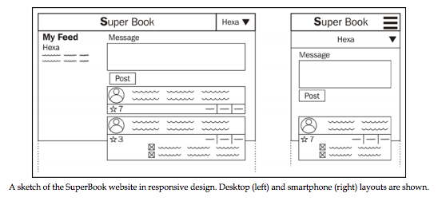

#第二章 应用设计

这一章，我们将会讲到以下主题：

 - 完整地收集客户需求
 - 创建一个简单的说明文档
 - 简单的HTML样例
 - 如何将工程分成一个个应用
 - 创建新的应用还是使用现有的
 - 开始一项工程前的最佳实践
 - 为什么选择Python 3？
 - 开始SuperBook工程

很多新手创建新工程的方式就是立即开始写代码。这很可能会遇到类似一开始就不正确的假设，设计出之后完全用不上的特性以及完全在浪费时间的情况。即使是在一个非常紧急的项目里，花一些时间从你的客户那儿了解他们的核心需求也很可能会取得你意想不到的效果。管理需求是一个非常关键的值得学习的技能。

##如何收集客户需求

>Innovation is not about saying yes to everything. It's about saying NO to all but the most crucial features.
>
>
- Steve Jobs

我曾经通过花几天时间仔细倾听客户的需求并给予他们合理的期待值拯救了几个非常糟糕的项目。你只需要拿上铅笔和纸(或者它们的电子版)，整个过程实际上是非常简单但高效的。在你收集客户需求的时候，有以下方面你需要注意一下：

 1. 直接和应用的所有者讨论，即使他不懂技术。
 2. 确保你听全了他们的需求并做好了笔记。
 3. 不要使用类似“模型”这样的技术词汇。使用类似“用户资料”这样的对他们来说更简单更友好的词汇。
 4. 给予他们正确的期待值。如果他们的需求里有技术上不可行或者非常难的点，一定要立即告诉他们。
 5. 草图越多越好。视觉化是人类的天性。网站更需要如此了。大概的线条和图案就足够了，这时候不需要完美。
 6. 将类似用户注册这样的整体流程分成小部分。将多步骤的模块之间用箭头连接起来。
 7. 最后，用故事或者其他易于理解的形式将所有的特性列表过一遍。
 8. 积极地给所有特性标出高，中，低优先级。
 9. 对于新特性一定要持非常保守的态度。
 10. 在这之后开一个小会，将你的笔记与小队里其他人分享，确保没有错误的解读用户需求。

第一个会议将会很长(也许是在工作室一整天，或者分成几个几小时的小会)。慢慢的，随着会议越来越频繁，你可以将它们的时间缩减到半小时到一小时左右。

这些会议的成果一般是一页写满的纸和一些潦草的草图。

在这本书里，我们接受了一个神圣的项目——构建一个名为SuperBook超级英雄的社交网络。这里有一张我们讨论过以后画出来的草图，里面的超级英雄都是随便选的：

##你会讲故事吗？